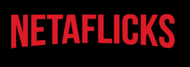
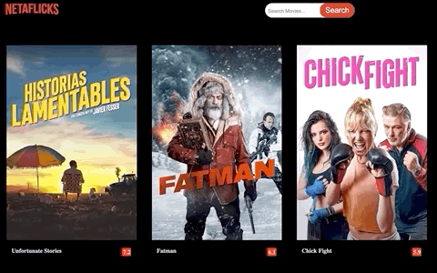
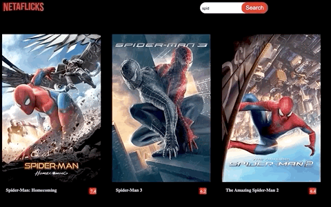

# 
NetaFlicks is a web application that allows users to search for movies, and upvote or down vote desired movies. 
## Table of Contents
* [Getting Started](#getting-started)
* [Features](#Features)
* [Tech Stack](#tech-stack)
* [Tools](#Tools)
* [License](#license)

## Getting Started

### Prerequisites

1. Install the [NetaFlicks Rails Backend API](https://github.com/21shield/NetaFlicks-backend)

2. Install [Node.js and npm](https://www.npmjs.com/get-npm)

    ```console
    $ brew install node
    ```

### Starting the Frontend
1. Clone this repository and `cd` into the directory
2. Install all dependencies

   ```console
   $ npm install
   ```

3. Start the Frontend server

    ```console
    $ npm start y
    ```
## Features

### Look through movies that are popular and Search.


### Upvote and Downvote movies.


## Tech Stack
* React.js
* Rails API
* PostgreSQL
* HTML/CSS

## Tools
* [Rack CORS](https://github.com/cyu/rack-cors)
* [rest-client](https://rubygems.org/gems/rest-client)


[Go To Top](#NetaFlicks)
<a name="Title"></a>